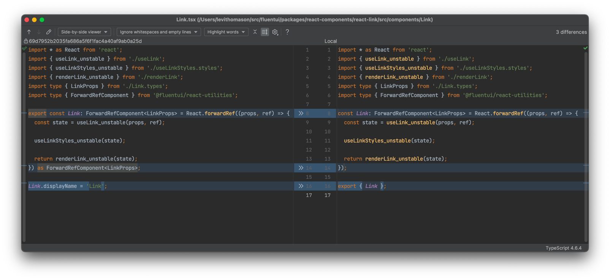

# SCI: Source Code

We created SCI by hand to discover and test our methodology.

Summary of Findings:
...

## Link Component Example

A Fluent UI React component file was chosen at random for the first trial, `Link.tsx` from `@fluentui/react-link`. This project is component-centric making it a reasonable choice. This particular component was kept for its simplicity.

```tsx
import * as React from 'react';
import { useLink_unstable } from './useLink';
import { useLinkStyles_unstable } from './useLinkStyles.styles';
import { renderLink_unstable } from './renderLink';
import type { LinkProps } from './Link.types';
import type { ForwardRefComponent } from '@fluentui/react-utilities';

/**
 * A Link is a reference to data that a user can follow by clicking or tapping it.
 */
export const Link: ForwardRefComponent<LinkProps> = React.forwardRef((props, ref) => {
  const state = useLink_unstable(props, ref);

  useLinkStyles_unstable(state);

  return renderLink_unstable(state);
  // Work around some small mismatches in inferred types which don't matter in practice
}) as ForwardRefComponent<LinkProps>;

Link.displayName = 'Link';
```

### Static Analysis

#### Draft 1 - TODO: finish yml file contents and update this section

##### Observations

The original file was:

- 20 lines
- 763 characters

The handcrafted draft static analysis was:

- 52 lines (260%)
- 2,078 characters (272%)

It was also clear that much of the information in the static analysis was directly duplicating the source file, adding no more value than passing the file to the model whole. Removing this information we get the following:

- 31 lines (155%)
- 1,523 characters (199%)

There is also the idea that we could compress the information in the static analysis so that the analysis file is smaller than the source file.

- TODO lines
- TODO characters

Example:

```yml
TODO
```

##### File Context

It may be that the handcrafted static analysis is more verbose than including the entirety of the file itself.

```yaml
package: '@fluentui/react-link'
path: packages/react-components/react-link/src/components/Link/Link.tsx
dependants:
  - name: '@fluentui/react-components'
    path: packages/react-components/react-components
  - name: '@fluentui/react-breadcrumb'
    path: packages/react-components/react-breadcrumb
  - name: '@fluentui/vr-tests-react-components'
    path: apps/vr-tests-react-components
referenced_in:
  - rfcs/react-components/convergence/fixed-versions-for-prerelease.md
contributors:
git_history_summary:
  - commit: '871192b67e'
    message: 'chore: enforce files naming to use .styles.ts [cxe-red files] (#27710)'
    name: 'Oleksandr Fediashov'
    datetime: 'Thu Apr 27 18:10:19 2023'
    changes: '+0200'
  - commit: '88fa8f2795'
    message: '(chore) Move react-input, react-label, react-link to react-components subfolder (#22694)'
    name: 'Tristan Watanabe'
    datetime: 'Fri Apr 29 08:36:01 2022'
    changes: '-0400'
TODO_changes_with: 'TODO: a list of files that tend to change with this file'
TODO_changelog: 'TODO: recent changelog entries that include this file'
TODO_tools: |
  Which tools are involved with this file? Example:
  typescript - because tsconfig includes this file's package name
  nx - because nx's workspace.json includes this file's package name
TODO_configs: |
  What configuration files are involved with this file? Examples:
  tsconfig.base.json - because this package name is included in the file, and its file is included in the tsconfig's include list or pattern when executing
```

When GPT-4 was provided with this definition and prompted:

> This was extracted from a code file. Recreate the file as detailed as possible.

It generated the following:

```typescript
/**
 * This file contains the Link component.
 *
 * A Link is a reference to data that a user can follow by clicking or tapping it.
 *
 * @package @fluentui/react-link
 * @path packages/react-components/react-link/src/components/Link/Link.tsx
 * @exports {ForwardRefComponent<LinkProps>} Link
 */

import * as React from 'react';
import { useLink_unstable } from './useLink';
import { useLinkStyles_unstable } from './useLinkStyles.styles';
import { renderLink_unstable } from './renderLink';
import type { LinkProps } from './Link.types';
import type { ForwardRefComponent } from '@fluentui/react-utilities';

/**
 * @typedef ForwardRefComponent<LinkProps> Link
 */
const Link: ForwardRefComponent<LinkProps> = React.forwardRef((props, ref) => {
  // The hook useLink_unstable() can be used to manage state and other React features.
  const state = useLink_unstable(props, ref);

  // Apply styles to the component.
  useLinkStyles_unstable(state);

  return renderLink_unstable(state);
});

export { Link };
```

Ignoring code comments, the diff of the two is nearly identical:


Figure 1: Diff of Link.tsx and GPT-4 generated Link.tsx from file context

**Package context**

In may be enough to include the package.json as the context:

```yaml
part_of: @fluentui/react-components
name: '@fluentui/react-link'
path: packages/react-components/react-link/package.json
scripts: TODO
```

### Natural Language Analysis

**Why: Summary (1-2 sentences)**

**Why: Description (~200-300 words)**

**How: Summary of logic (functional description)**

**Meaningful contributors**

- Churn

## Draft 2

Include head of the component file

- Path number of files in each path
- List of adjacent
- ...
