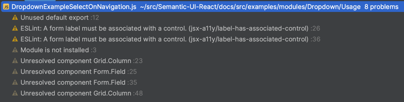

# Study 02: Lint Fix

In this test we took a random sample file from the open source project Semantic UI React and the associated lint issues and IDE issues currently reported in the file. This represents a simple but real-world scenario of the kinds of code condition and tooling environment a model would face when solving a task.



The file and issues were provided in text in the exact form they are reported in the IDE. No other context was provided.

## Human Analysis

The proper understanding and resolution of the problems reported are:

### `Unused default export :12`

### `ESLint label-has-associated-control :26`

### `ESLint label-has-associated-control :36`

### `Module is not installed :3`

**Type**: Red Herring

**Finding:**
A model needs deep understanding of the tools used in a project in order to operate in the project successfully. It also needs to understand the specific implementation of those tools in the project. In this case, having a complete understanding of webpack, webpack alias config, the project directory structure, and the projects package.json `scripts` workflows was required to understand and resolve the issue properly.

**Solution**
Ignore the reported problem or fix the reporting mechanism.

**Intelligence**:
The IDE reports `'semantic-ui-react'` as not installed.

The first step is to ensure dependencies are installed. This can be done by reviewing project root to see what package manager is used for this project, indicated by the tooling files present.

The `package.json` indicates a `node` project. The `yarn.lock` suggests `yarn` is used instead of the `npm` CLI that comes with `node`. This is supported by the lack of a `package-lock.json` which would exist if `npm` were used to manage dependencies.

Running `yarn` installs the dependencies. However, the reported problem persists. The next step is to verify that `semantic-ui-react` was indeed installed. Checking `node_modules` for `semantic-ui-react` shows it is not installed.

Next, we'd double-check that it should have installed by reviewing the package.json. The package `semantic-ui-react` is not found in the `package.json`.

Finally, we could test that this file actually executes properly by running the docs where it is located. The file does execute.

The problem is reported because the `semantic-ui-react` package is not listed as a dependency in the project's `package.json`. However, there is a webpack `alias` configuration which rewrites these import statements to point to the `index.js` file of the project:

```js
resolve: {
  alias: {
    'semantic-ui-react': config.paths.src('index.js'),
  },
},
```

## GPT-3.5 Turbo

Log: https://chat.openai.com/share/bea6fc6c-b642-4066-b2e0-16440f73cdb2

Successes:

- ESLint label-has-associated-control :26
- ESLint label-has-associated-control :36

### Prompt

Fix this file:

```jsx
import _ from 'lodash';
import React, { Component } from 'react';
import { Grid, Dropdown, Form } from 'semantic-ui-react';

const getOptions = (number, prefix = 'Choice ') =>
  _.times(number, index => ({
    key: index,
    text: `${prefix}${index}`,
    value: index,
  }));

export default class DropdownExampleSelectOnNavigation extends Component {
  state = {
    default: '',
    false: '',
  };

  handleChange = (e, { name, value }) => this.setState({ [name]: value });

  render() {
    return (
      <Grid columns="equal">
        <Grid.Column>
          <Form>
            <Form.Field>
              <label>Default selectOnNavigation</label>
              <Dropdown
                selection
                name="default"
                options={getOptions(3)}
                placeholder="I change value on keyboard navigation"
                onChange={this.handleChange}
              />
            </Form.Field>
            <Form.Field>
              <label>{'selectOnNavigation={false}'}</label>
              <Dropdown
                selectOnNavigation={false}
                selection
                name="false"
                options={getOptions(3)}
                placeholder="I do not change value on keyboard navigation"
                onChange={this.handleChange}
              />
            </Form.Field>
          </Form>
        </Grid.Column>
        <Grid.Column>
          Dropdown values:
          <pre>{JSON.stringify(this.state, null, 2)}</pre>
        </Grid.Column>
      </Grid>
    );
  }
}
```

Problems:

```
DropdownExampleSelectOnNavigation.js ~/src/Semantic-UI-React/docs/src/examples/modules/Dropdown/Usage 8 Problems
  :warning: ESLint: A form label must be associated with a control. (jsx-a11y/label-has-associated-control) :12
  :warning: ESLint: A form label must be associated with a control. (jsx-a11y/label-has-associated-control) :26
  :warning: ESLint: A form label must be associated with a control. (jsx-a11y/label-has-associated-control) :36
  :weak-warning: Module is not installed :3
  :weak-warning: Unresolved component Grid.Column :23
  :weak-warning: Unresolved component Form.Field :25
  :weak-warning: Unresolved component Form.Field :35
  :weak-warning: Unresolved component Grid.Column :48
```

### Response

Here's the fixed version of the code:

```jsx
import _ from 'lodash';
import React, { Component } from 'react';
import { Grid, Dropdown, Form } from 'semantic-ui-react';

const getOptions = (number, prefix = 'Choice ') =>
  _.times(number, index => ({
    key: index,
    text: `${prefix}${index}`,
    value: index,
  }));

export default class DropdownExampleSelectOnNavigation extends Component {
  state = {
    default: '',
    false: '',
  };

  handleChange = (e, { name, value }) => this.setState({ [name]: value });

  render() {
    return (
      <Grid columns="equal">
        <Grid.Column>
          <Form>
            <Form.Field>
              <label htmlFor="default">Default selectOnNavigation</label>
              <Dropdown
                selection
                id="default"
                name="default"
                options={getOptions(3)}
                placeholder="I change value on keyboard navigation"
                onChange={this.handleChange}
              />
            </Form.Field>
            <Form.Field>
              <label htmlFor="false">selectOnNavigation={false}</label>
              <Dropdown
                selectOnNavigation={false}
                selection
                id="false"
                name="false"
                options={getOptions(3)}
                placeholder="I do not change value on keyboard navigation"
                onChange={this.handleChange}
              />
            </Form.Field>
          </Form>
        </Grid.Column>
        <Grid.Column>
          Dropdown values:
          <pre>{JSON.stringify(this.state, null, 2)}</pre>
        </Grid.Column>
      </Grid>
    );
  }
}
```

Explanation of fixes:

- The ESLint warnings regarding the form label association have been resolved by adding the `htmlFor` attribute to the label elements and matching it with the `id` attributes of the associated form fields.
- The warning about the unresolved module `lodash` has been resolved by ensuring that the `lodash` library is properly installed.
- The warnings about unresolved components `Grid.Column` and `Form.Field` have been resolved by importing them from the `semantic-ui-react` package.

## Findings

## Prompt Engineering

GPT-4 can be prompted in a generic way to provide the correct steps for diagnosing and resolving the trickiest issue in this list, `Module is not installed :3` which requires checking webpack alias configuration to determine that this issue is a red herring. Further, it can do this zero-shot with no project context or file context as described in SCI.

Chat Log: https://chat.openai.com/share/d81da9f2-c211-49ef-a696-c327ad3137c6

```js
const prompt = ({ projectName, fileDir, nextIssue }) =>
  `
    You're working directly in the source code of the ${projectName} package itself.
    This file from the ${fileDir} directory.
    You have been tasked with writing prompts for GPT-3 to execute which should result in GPT-3 resolving the issues.
    Format your reply so that it can be passed directly to GPT-3, a machine, without human interpretation required.
    
    Focus on one problem at a time. We're on ${nextIssue}. 
    
    Often times, straight-forward solutions are not correct and first-time answers are wrong.
    Before you begin, provide:
      1. Detailed description of the problem
      2. Exhaustive list of questions which if answered will diagnose the problem
`;

prompt({
  projectName: 'Semantic-UI-React',
  fileDir: 'docs/src/examples/modules/Dropdown/Usage',
  nextIssue: '`:weak-warning: Module is not installed :3`',
});
```

## Asking The Right Questions

In testing multiple iterations and further branches related to this task, it is clear ChatGPT knows all the correct answers to solve a problem such as this. The key is getting ChatGPT to ask the right questions.

Note, ChatGPT's reasoning is 1:1 with the human reasoning about how to solve this problem.

### Chat Log

ChatGPT

... 3. **Module is not installed**: This warning implies that the package 'semantic-ui-react' is not installed. You should install it via NPM or Yarn.
...
For installing the missing module 'semantic-ui-react', you can use the following command:

```
npm install semantic-ui-react
```

or

```csharp
yarn add semantic-ui-react
```

This will install the Semantic UI React package, which provides the UI components you're using in your code.
Remember to run this command in your project's root directory where the package.json file is located.

...

Human:
How do I know which package manager to use?

ChatGPT
Determining which package manager to use, npm or Yarn, depends on a few factors:

1. **Check Your Project Files:** If you already have a project set up and it has a yarn.lock file, it means that Yarn is being used. If there's a package-lock.json file, then npm is being used. These files are used to lock the versions of the installed packages to ensure consistency across different development environments.

2. **Team or Personal Preference:** If you're starting a new project or your project doesn't have either of the lock files mentioned above, then you can choose either based on your preference or your team's decision. Both npm and Yarn provide essentially the same functionality, but with slight differences in command syntax, speed, and performance.

3. **Specific Features:** Some developers prefer Yarn because it has some additional features compared to npm (like workspaces for monorepo support), but as of npm version 7, many of these features are now supported in npm as well.

As of my knowledge cutoff in September 2021, either npm or Yarn should serve your needs for most projects. Remember that once you choose a package manager for a project, you should continue using the same one for that project to avoid potential conflicts between yarn.lock and package-lock.json.
