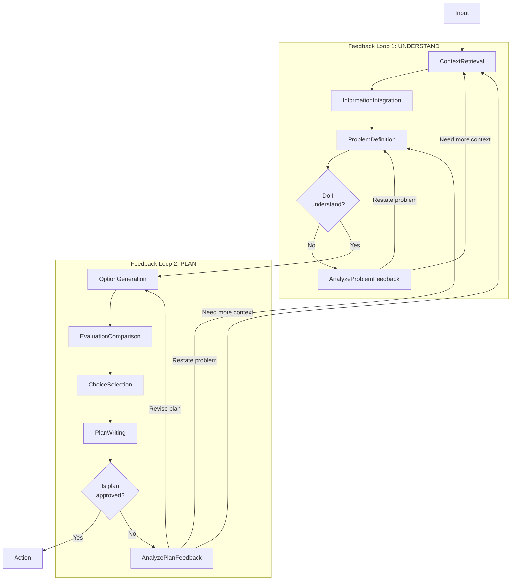

# Notes

Freeform notes about the project as they come to mind.

## Ideas

### First-nail

- Document a project
- Work on itself

#### Solve a GitHub issue

Fix nvm slow start issue: https://github.com/nvm-sh/nvm/issues/2724

#### Real world needs encountered

I encountered a lint rule for "no-magic-numbers" when checking `e.button === 2` for right click:

```ts
const handleClick = React.useCallback(
  (e: React.MouseEvent<HTMLDivElement>) => {
    if (e.button === MOUSE_RIGHT_CLICK_BUTTON) {
      e.preventDefault();
      setIsContextMenuOpen(true);
    }
  },
  [setIsContextMenuOpen]
);
```

Potential question for Pair Programmer:
1. "How is this normally handled? <code snippet>"
2. "How does this repo handle checking for right click?"

This could have been handled with the local vector store indexing the codebase and the LLM querying it for the answer.

In the case of `2`, the Understanding/Planning loop should result in generating a query for the vector store. It should first be tested to see what tool-based solution the LLM comes up with on its own. If not sufficient, a more tailored flow could be set up to get the LLM to generate good vector store queries.

### Project

Should include name, purpose, goals, etc. which capture the intent of the project. Any other info needed to form a vision for the project's future and guide decision-making should be included. Decisions are not based on the tech or the current state, they are based on the project's purpose and goals.

### Context

#### Tracking with the user

When pair programming with a colleague, the colleague is aware of every action the other is taking since they can observe the user's actions.

This information could be useful to GPT as well for tracking with the user. Events could be generated each time the user interacts with their IDE, browser, or terminal. This list of events could then be fed to GPT so it is aware of what the user has been up to and can better assist.

#### Contextualizing

Agents get off track easily, due to making incorrect assumptions or ill-informed decisions which lack context. The missing context is the actual state of the codebase, which they should _always_ first prove to themselves before continuing.

LLMs rely on their training data to predict output tokens. They need to rely on codebase intelligence and project knowledge first, then supplement with their token predicting power.

Many ideas explored so far deal with trying to pre-emptively design mechanisms that will implicitly provide context that the agents will need. However, intuition tells us this is not possible given the infinite possible paths through the future and the variation of context required for each path. It seems most likely that agents must build their own context, appropriately, as needed.

The AIs could be split into several agents. Each with a narrow task, which can then collaborate.

**Hypothetical Agents**

TThese two could run in loop to strengthen and supplement any decision process by contextualizing them in ground truth:
- `Socratic` - Socratic questioning agent, prompting learning in other agents by asking them questions.
- `Empirical` - Answers questions strictly with empirical data from the  codebase intelligence, project knowledge, or from humans only. No predictions allowed.

These agents could be called to create ideas:
- `Creative` - Identifies novel ideas and possibilities.
- `Idealist` - Identifies ways to improve things.
- `Theorist` - Identifies tried and true, hypothetical, solutions.

These agents could be called for analyzing ideas:
- `Skeptic` - Identifies ways in which things will go wrong.
- `Optimist` - Identifies ways in which things will go right.
- `Realist` - Identifies how things will actually go.

These agents could be called to make decisions:
- `Pragmatist` - Identifies ways to get things done.
- `Executive` - Concerned with moving forward, making decisions, and taking action.

**Understanding & Planning**



**1. Input**
- This stage captures the very first interaction with the system.
- **Source**: User input, another LLM's output, or a function's return value.
- **Action**: Obtain and preprocess the given input, marking the starting point of the entire decision-making process.

**2. Context Retrieval**
- In this stage, the LLM queries various data sources to gather context.
- **LLM Call**: Query different persistence solutions to fetch relevant data.
- **Data Sources**: SQL databases of past messages, knowledge graph DB, vector store of project code and docs, GitHub interactions, project management systems, and more.
- **Output**: A cohesive set of data and context pulled from various sources related to the current input.

**3. Information Integration & Attention Allocation**
- After retrieving context, the LLM integrates this with the current stimulus.
- **LLM Call**: Combine the fetched context with the current input, ensuring alignment and coherence.
- **Output**: A consolidated set of information, filtered for the most relevant details.

**4. Problem Definition**
- The LLM tries to understand the nature of the task based on the integrated information.
- **LLM Call**: Identify whether the task is a problem to be solved or a decision to be made.
- **Output**: A well-defined representation of the task.
- **Feedback Loop 1**: The system then checks with the user if it has understood the problem correctly. Depending on the user's response, it might refine its understanding or proceed to the next stage.

**5. Option Generation**
- Here, the LLM proposes possible tools or approaches to tackle the task.
- **LLM Call**: Generate a list of potential tools, methods, or solutions.
- **Output**: A range of possible options to address the defined task.

**6. Evaluation and Comparison**
- The LLM evaluates the generated options based on various criteria.
- **LLM Call**: Assess the pros, cons, risks, and benefits of each option.
- **Output**: A detailed evaluation of each proposed option.

**7. Choice Selection**
- Based on evaluation and comparisons, the LLM selects the best-suited option.
- **LLM Call**: Choose the optimal tool, method, or solution.
- **Output**: The final selection that's ready to be put into action.

**7. Plan Writing**
- The LLM creates a plan for the chosen option.
- **LLM Call**: Write a plan of action for the selected option.
- **Feedback Loop 2** The system presents its plan to the user and seeks approval. If the user doesn't approve, the LLM analyzes the feedback and either revises its plan, restates the problem, or fetches more context.

**8. Action**
- The LLM initiates the chosen action.
- **LLM Call**: Execute the selected decision or action.
- **Output**: Tangible results, such as changes in the codebase, data alterations, or any other definitive outcomes.

#### Mind/Memories

On topic/context switch, query memories and feed these to GPT.

Have a flow where GPT saves summarized memories at appropriate times. Documents in a vector store or similar. This could be a tool where GPT decides when and what to remember, or hard-coded into the chat pipeline where each message has an opportunity to be saved. A lightweight/cheap/fast LLM classifier could decide if this should be remembered.

### Picking up where you left off

Building context, "ramping up"

### Terminal Tool

**long-running**
Current tool is ephemeral.
Could add /terminal/open|close type behavior to allow for long-running tasks.
Capture output and allow 

Have a POST/GET for "/terminal" to run/read commands. Capture input/output, show GPT's terminal in the UI. 

**history**
Can we derive useful info from reading shell history files? Shows what CLIs have been used recently.

**user's terminal**  
It would be helpful if the user's terminal were viewable by GPT. In one case, I have a server log error which if seen by GPT it could have debugged. Perhaps this could be a server log thing instead...

### UI & GPTs "IDE"

GPT interacts with tools (terminal, browser, etc.).
The GUI could show the user what GPT "sees" by showing the tools GPT has open and what data is displayed in them.

Each tool could be shown as a "tab" in the UI. The contents of the tab being the tool's return data. Example:

```
Terminal  |  Browser |  File
-----------------------------
$ ls     |  Google  |  index.html
$ cd ..  |  Google  |  README.md
$ ls     |  Google  |  NOTES.md
```


```