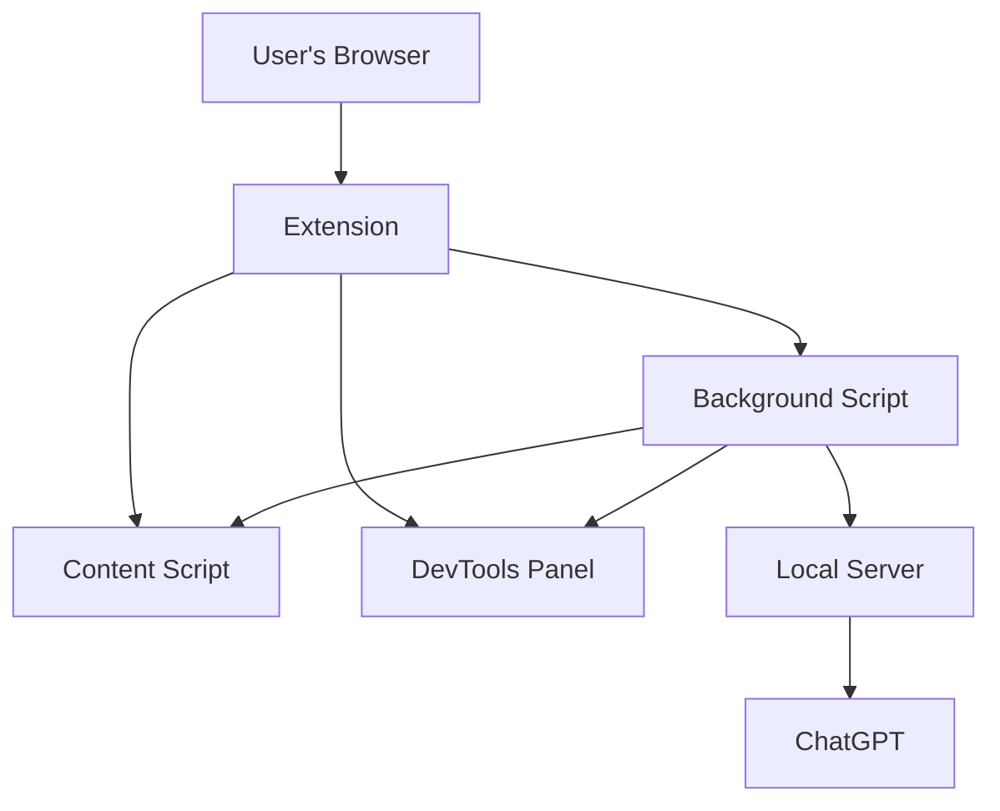

# ChatGPT Browser Extension Architecture

## Overview

The ChatGPT browser extension is designed to provide a seamless bridge between the user's browser, the local server, and ChatGPT. This document outlines the architecture of the extension, its components, and an illustrative end-to-end scenario.

## Architecture Diagram

**Key:**
- **B.G.**: Background
- **D.T.P**: DevTools Panel

This diagram illustrates the main components of the extension and their interactions. The arrows indicate the flow of communication between components.

## Components

### 1. Content Script (`content.js`)

- **Role:** Interacts directly with the web content in the user's browser.
- **Responsibilities:** Detect user interactions, manipulate the DOM, and communicate with the background script.

### 2. Background Script (`background.js`)

- **Role:** Manages the extension's behavior and serves as the communication hub.
- **Responsibilities:** Handle messages from the content script, manage the WebSocket connection with the local server, and relay commands and data between the server and the DevTools panel.

### 3. DevTools Panel (`devtools.html` & `devtools.js`)

- **Role:** Provides a custom panel within the browser's developer tools for user interaction.
- **Responsibilities:** Display information, capture user inputs, execute DevTools commands, and communicate with the background script.

### 4. WebSocket Connection

- **Role:** Establishes a real-time communication channel between the background script and the local server.
- **Responsibilities:** Transmit commands from ChatGPT to the extension and send data/results back to ChatGPT.

Got it! Here's a visual ASCII representation of the ChatGPT Browser Extension Architecture & Communication Flow:

## End-to-End Scenario

1. **User Interaction:** The user opens a web page and launches the developer tools.

2. **Panel Activation:** The user navigates to the ChatGPT DevTools panel. This action loads the `devtools.js` script and establishes the WebSocket connection if not already active.

3. **ChatGPT Command:** ChatGPT, through the local server, sends a command via the WebSocket connection to inspect a specific element on the page.

4. **Command Execution:** The background script receives the command and relays it to the `devtools.js` script, which then executes the command within the DevTools context.

5. **Result Gathering:** The `devtools.js` script captures the result (e.g., computed styles of an element) and sends it back to the background script.

6. **Feedback to ChatGPT:** The background script sends the result back to the local server via the WebSocket connection, which then relays it to ChatGPT.

7. **User Feedback:** The result or any additional instructions from ChatGPT are displayed in the ChatGPT DevTools panel for the user to see.

## Conclusion

The ChatGPT browser extension architecture is designed for real-time interactions between the user's browser, ChatGPT, and the local server. By leveraging a WebSocket connection and a custom DevTools panel, the extension provides a dynamic and interactive debugging experience, allowing for direct commands from ChatGPT and immediate feedback to the user.